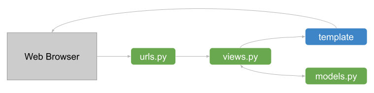

# Views and Templates

Django Administration is nice and quick tool to quickly prototype a data model, and even make it usable in production. But it is definitely not done for a primary user interface. However, For that, we dig deeper and make use of the whole framework architecture: 

## Objectives

* Write a simple `index` view as a dashboard and URL for it.
* Create the `base.html` template, from which all other Django templates will inherit.
* Create a front-end template for the dashboard.

## Simple Dashboard View

Views in Django can be function based or class based. Both have their advantages and disadvantages, and their uses. So there is no universal better way to implement a view. We will start with function based view `index`, which will render basic dashboard.

Firstly, in our `tasks/views.py` file, we import our models:

```Python
from django.shortcuts import render
from . import models
```

We could also import specific models, it is up to you. But this way is cleaner in most cases, especially if app grows and we add more models. This way, for example, we can reuse access `django.contrib.auth` function `get_user_model` from there without extra importing.

We can use Django shortcut `render` for the result of any function to make it into HTML web page. We need to give it these arguments:

* pass through HTTP `request` we are getting from the web server as the first argument.
* path to the HTML template filename, which Django will try to find according to how it is configured in project's `settings.py`. By default, it will start with app's `templates` directory. We will make sure the template gets there later.
* any data from models, or anything from Python basically, must be constructed into a `context` dictionary.

```Python
def index(request):
    context = {
        'projects_count': models.Project.objects.count(),
        'tasks_count': models.Task.objects.count(),
        'users_count': models.get_user_model().objects.count(),
    }
    return render(request, 'tasks/index.html', context)
```

Then, in our `tasks/urls.py` we can add the path from which this view will be accessible from the web browser:

```Python
from django.urls import path
from . import views

urlpatterns = [
    path('', views.index, name='index'),
]
```

The `path` function takes two arguments:

* `route` string defines relative path portion. If we leave empty string here, the root path of the app's URL will be used. It is good practice for the app to have at least one root path, ideally for main dashboard or index view.
* `view` argument must be a view's function or method, which returns `HTTPResponse`. This is how HTTP protocol basically works: browser sends `HTTPRequest` and awaits `HTTPResponse`. Django view happens in the middle, and the result is rendered HTML page.
* we can set a keyword argument `name` for each `urlpatterns` list item. It is a good practice, because we can then reverse to such URLs from other views, or even make procedural links from other HTML templates.

## Base template

HTML language has no abstraction functionality by default, and each page must be rendered explicitly, including all repeating elements and metadata. Doing so for each page we render is counterproductive. Base template takes care of the common elements and metadata, so we can focus on each view-specific page in it's templates.

For now we will set up a basic not styled base template and improve it in later, one step at a time:

If you have Django VS Code extension, you can disable it now and reload VS Code. Then, create `base.html` file in `tasks/templates/` directory, and put exclamation mark `!` and ENTER. It should generate the most basic template.

```HTML
<!DOCTYPE html>
<html lang="en">
<head>
    <meta charset="UTF-8">
    <meta name="viewport" content="width=device-width, initial-scale=1.0">
    <title>Document</title>
</head>
<body>
    
</body>
</html>
```

Now we can re-enable the Django extension and continue. We will leave most things as they are, as it suits us for now. Just add some blocks.

In the `<title>` tag, instead of "Document" title we will add a block `title` with default value of our project name.

```HTML
<title>TASKer</title>
```

So all pages of our project will have the default title "TASKer". However, if we will create the `title` named block in our templates, we will be able to ammend this value.

We will also add block `content` in the `<main>` tag inside the `body` tag.

```HTML
<body>
    <main></main>
</body>
```

We intentionally left that block empty. It will be the job of our views to fill it in in it's templates. Done with the base template for now.

## Front-end template for the dasboard

Now we can create `tasks` directory inside `tasks/templates` directory. We need to do so, to avoid template overrides from other apps we might be using in our project. Even if each app has it's own `templates` directory, Django compiles the common template discovery tree and uses only one template with the specific path relative to `templates` directory. So for example, if there are two `templates/index.html` files across several apps, only the first one will be used. The loading order is decided by `INSTALLED_APPS` list in project's `settings.py`. 

So, in our `index.html` file, instead of repeating tag hierarchy, we just extend `base.html` template, and fill the blocks with the relevant context coming from the views.

```HTML


    <h1>TASKer</h1>
    <p>Users: {{ users_count }}</p>
    <p>Projects: {{ projects_count }}</p>
    <p>Tasks: {{ tasks_count }}</p>

```

Now our view should be functioning. Try it out.

## Assignment

Create the basic dashboard for your blog project's users, pages and categories. You will need a view, added entry with it in your app's `urls.py`, and HTML template. Don't forget the base template as well.
